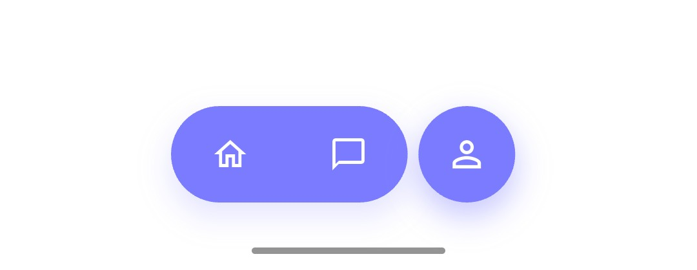

# cmx_capsule_nav




A premium, custom animated floating capsule-style navigation bar for Flutter. Designed for modern apps that crave a unique, fluid, and interactive navigation experience.

## Why cmx_capsule_nav?

Unlike traditional bottom navigation bars, `cmx_capsule_nav` features a **dynamic morphing animation**. When you switch between items, the active bubble fluidly expands or contracts, creating a "capsule" effect that feels alive and responsive.

## Features

- 🚀 **Fluid Morphing**: Smooth animations that transition between active and inactive states.
- 🎨 **Fully Customizable**: Control every aspect—colors, icons, shadows, animation curves, and durations.
- 📱 **Floating Design**: A modern, elevated look that stands out from standard UI components.
- 🛠️ **Easy Integration**: Built to work seamlessly with Flutter's `ThemeData` and standard `IconData`.
- 📏 **Responsive Layout**: Automatically adjusts its width based on the number of items and your constraints.

## Installation

Add the dependency to your `pubspec.yaml`:

```yaml
dependencies:
  cmx_capsule_nav: ^0.0.2
```

Then run:
```bash
flutter pub get
```

## Usage

Using `CmxCapsuleNav` is as simple as providing a list of items and a callback:

```dart
import 'package:cmx_capsule_nav/cmx_capsule_nav.dart';

CmxCapsuleNav(
  currentIndex: _selectedIndex,
  items: [
    CmxCapsuleNavItem(icon: Icons.home_outlined),
    CmxCapsuleNavItem(icon: Icons.chat_bubble_outline),
    CmxCapsuleNavItem(icon: Icons.person_outline),
  ],
  onTap: (index) {
    setState(() {
      _selectedIndex = index;
    });
  },
  theme: CmxCapsuleNavTheme.defaultTheme(context),
)
```

## Customization

You can fully customize the navigation bar using the `CmxCapsuleNavTheme` class. You can either use the `defaultTheme` factory or create your own:

```dart
CmxCapsuleNav(
  // ... other properties
  theme: CmxCapsuleNavTheme(
    activeColor: Colors.deepPurple,
    inactiveColor: Colors.deepPurple.withValues(alpha: 0.2),
    activeIconColor: Colors.white,
    inactiveIconColor: Colors.deepPurple,
    animationDuration: const Duration(milliseconds: 800),
    animationCurve: Curves.elasticOut,
    barHeight: 90.0,
    bubbleHeight: 70.0,
    activeWidth: 70.0,
    maxWidth: 250.0,
  ),
)
```

### Theme Parameters

| Parameter | Description | Default |
|-----------|-------------|---------|
| `activeColor` | Background color of the active bubble | `Color(0xFF7B7BFF)` |
| `inactiveColor` | Background color of inactive capsules | `Color(0xFF7B7BFF)` |
| `activeIconColor` | Color of the active icon | `Colors.white` |
| `inactiveIconColor` | Color of inactive icons | `Colors.white` |
| `animationDuration` | Duration of the morphing animation | `600ms` |
| `animationCurve` | Curve of the morphing animation | `Curves.easeOutExpo` |
| `barHeight` | Total height of the navigation bar container | `80.0` |
| `bubbleHeight` | Height of the individual capsules/bubbles | `60.0` |
| `activeWidth` | Width of the active item bubble | `60.0` |
| `maxWidth` | Maximum width of the entire navigation bar | `220.0` |

## License

This project is licensed under the MIT License - see the [LICENSE](LICENSE) file for details.
